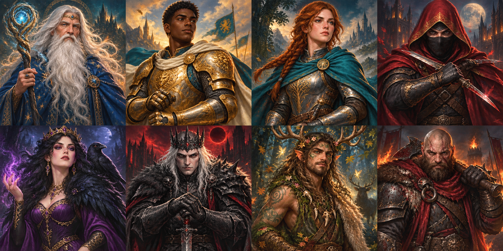

# Avalon — The Round Table

An illustrated, self-hosted multiplayer adaptation of **The Resistance: Avalon**. Built for 5–10 friends using separate screens, with a complete solo practice mode.


## Play on Windows

Install **Node.js 24 or newer**, then double-click **Start Avalon.cmd**. The launcher installs dependencies for Windows when needed, builds the game, opens your browser, and starts the server. Keep its terminal open while playing.

Or use a terminal in this folder:

```sh
npm ci
npm run build
npm start
```

Open **http://localhost:4173**. Create a room, share its six-character code, and wait for everyone to ready up. A practice table adds four computer players automatically.

For other devices on your home network, use **http://YOUR-PC-LAN-IP:4173**. Run `ipconfig` on Windows to find the active network adapter's IPv4 address. Allow Node through the Windows firewall on your private network if prompted. Open the game using that LAN address before copying an invitation, so the link works for your friends. A `localhost` link only works on the hosting computer.

Players outside your network can use the production deployment at **https://avalon.ashishajin.com**. Behind a reverse proxy, preserve the original Host header so the same-origin checks work. Use one persistent server instance and persistent storage.

## What is included

- Private room codes, host controls, readiness, 5–10 seats, reconnects, and rematches.
- Server-assigned secret identities; no other players' roles or tokens are sent to the client during play.
- Merlin, Assassin, Percival, Morgana, Mordred, Oberon, Loyal Servant, and Minion.
- Correct team sizes, majority voting, tie rejection, rotating leaders, and five-rejection defeat.
- Anonymous quest results, the fourth-quest two-fail rule for 7–10 players, and assassination.
- Public vote history and game chronicle.
- A full practice game with simple computer players. These demonstrate the rules, not human-level strategy.
- Original Camelot art and eight original illustrated portraits, with mobile layouts and keyboard-accessible dialogs.

Use an in-person conversation or a separate voice call. Voice and text chat are not built in. Optional expansion mechanics such as Lady of the Lake are not included.

## Development and checks

```sh
npm run dev
npm run typecheck
npm test
# With a development or production server running:
node tests/api-smoke.mjs
```

Set `AVALON_TEST_URL` to test a different server address. `npm test` exercises the game state machine and secrecy boundaries. The API smoke test uses five separate authenticated seats to finish a game and checks concurrent submissions, authorization, rematches, request limits, and practice rooms.

The frontend uses React and Vinext/Vite. The server uses Node's built-in SQLite, with synchronous transactions to serialize simultaneous decisions. Clients poll about once per second. Role assignment uses cryptographic randomness.

## Saved games

Rooms are stored in `.data/avalon.sqlite`, excluded from source control and blocked from the development file server. Override the directory with `AVALON_DATA_DIR`; keep it outside public assets. Treat this database as private: it contains role assignments. Only hashed player tokens are stored on the server.

Your seat token is stored in this browser tab's `sessionStorage`. Refreshing or restarting the server preserves the seat while the tab remains available. Clearing browser data or permanently closing the tab may lose that seat. Active games reserve all seats; they do not replace missing players or silently make decisions for them. Return with the original tab to continue.

Idle rooms expire after 24 hours. The server caps saved active rooms at 500. Back up the data directory only while the server is stopped, or use SQLite's backup tooling. Do not run multiple replicas with independent databases.

Dependencies contain platform-specific binaries. Run `npm ci` when switching between Windows and WSL. The Windows launcher detects this automatically.

## Artwork and attribution

All illustrations in `public/art` were generated specifically for this project. See [ASSETS.md](ASSETS.md) for the artwork inventory and briefs. No code or artwork was copied from Secret Hitler Online.

Interaction inspiration: [ShrimpCryptid / Secret-Hitler-Online](https://github.com/ShrimpCryptid/Secret-Hitler-Online), especially private lobbies, role reveals, and phase-specific prompts.

Game rules: [The Resistance: Avalon rulebook](https://avalon.fun/pdfs/rules.pdf). The Resistance: Avalon was designed by Don Eskridge and published by Indie Boards & Cards. This is an unofficial fan adaptation, not affiliated with or endorsed by the creators or publisher. Game names belong to their respective owners.

## Character artwork


